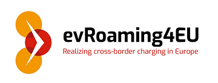

# OCPI

The Open Charge Point Interface (OCPI) enables a scalable, automated EV roaming setup between Charge Point Operators and
e-Mobility Service Providers. It supports authorization, charge point information exchange (including live status
updates and transaction events), charge detail record exchange, remote charge point commands and the exchange of
smart-charging related information between parties.

It offers market participants in EV an attractive and scalable solution for (international) roaming between networks,
avoiding the costs and innovation-limiting complexities involved with today's non-automated solutions or with central
roaming hubs. As such it helps to enable EV drivers to charge everywhere in a fully-informed way, helps the market to
develop quickly and helps market players to execute their business models in the best way.

What does it offer (main functionality):

* A good  roaming system (for bilateral usage and/or via a hub).
* Real-time information about location, availability and price.
* A uniform way of exchanging data (Notification Data Records and Charge Data Records), before during and after the
  transaction.
* Remote mobile support to access any Charge Point without pre-registration.

An international group of over 400 companies from all over the world already supports OCPI. Initiators are [EV
Box](https://evbox.com), [New Motion](https://newmotion.com), [ElaadNL](https://elaad.nl), BeCharged,
[GreenFlux](https://greenflux.com) and [Last Mile Solutions](https://lastmilesolutions.com). Other participants include:
[Next Charge](https://nextcharge.app), [Freshmile](https://freshmile.com), [Plugsurfing](https://plugsurfing.com),
[E55C](https://e55c.com), [GIREVE](https://gireve.com), OCN, [ihomer](https://ihomer.nl),
[Rexel](https://www.rexel.com), [Stromnetz Hamburg](https://www.stromnetz-hamburg.de),
[Enervalis](https://enervalis.com), [Place to plug](https://placetoplug.com), [Plugsurfing](https://plugsurfing.com),
[Ecomovement](https://www.eco-movement.com), [Allego](https://www.allego.eu), Gronn Kontakt Norway,
[ENIO](https://www.enio-management.com), [Fastned](https://fastnedcharging.com), [AvantIT](https://www.avantit.no),
[Chargemap](https://chargemap.com), [Involtum](https://www.involtum.com), Capitol Region Denmark,
[Vattenfall](https://vattenfall.com), [EON](https://www.eon.com), ECY Conseil Emeric Chardiny, Eneco Mobility, Google,
Jedlix, MTC, Smartlab, Sodetrel, XXIMO, Mnemonics, Share & Charge, Service House, Alfen / ICU, PI2 Consultancy,
Pitpoint, Blue Corner, Building Energy, Chargestorm, Chargepoint, ESARJ, Chargelab.co, MUVEXT, Next Green Car / Zap Map,
Be Mo Tech, Parking Eagle, GraphDefined, Chargecloud, Rutgerplantengaconsulting, Everon, Tanqyou, Electric Vehicle
Association Scotland (EVA NCS), EV-Tech, Plugin Power, [Last Mile Solutions](https://lastmilesolutions.com), BIA Power,
IBIL, Gridscape, Maxem, Virta, EasyCharger, Total EV Charge, Gowithflow, EKAROS, Rexel US, Stekker App, Travelcard,
Emobility Consulting. The EVRoaming foundation supported by the Netherlands Knowledge Platform for Charging
Infrastructure (NKL) facilitates and coordinates this protocol to guarantee progress and ensure development and results.

This document describes a combined set of standards based on the work done in the past. Next to that, the evolution of
these standards and their use are taken into account and some elements have been updated to match nowadays use.

## OCPI 2.2.1-d2

In the OCPI Development Working Group at the EV Roaming Foundation we are always tracking unclarities in the
specification and making changes to the specification document to fix these for later versions. We noticed that the OCPI
2.2.1 documentation had accumulated so many clarifications since the formal release of 2.2.1 that it is worthwhile to
make a new "documentation release", OCPI 2.2.1-d2. This release does not change the requirements compared to OCPI 2.2.1.
The purpose of OCPI 2.2.1-d2 is to document the same requirements as OCPI 2.2.1 but do so more clearly.

## OCPI 2.2.1

During implementation of OCPI 2.2 some issues where found that required updating the protocol to fix them. These are all
minor changes, so most OCPI 2.2 implementations would need no, or only minor changes, to upgrade to OCPI 2.2.1.

## OCPI 2.2

OCPI 2.2 includes new functionality and improvements, compared to OCPI 2.1.1.

### Changes/New functionality

* Support for Hubs
  * [Message routing headers](/04-transport-and-format/01-json-http-implementation-guide.md#message-routing)
  * [Hub Client Info](https://ocpi.dev)
* [Support Platforms with multiple/different roles](https://ocpi.dev)
* [Charging Profiles](https://ocpi.dev)
* [Preference based Smart Charging](https://ocpi.dev)
* Improvements:
  * [CDRs](https://ocpi.dev): Credit CDRs, VAT, Calibration law/Eichrecht support, Session_id,
    AuthorizationReference, CdrLocation, CdrToken
  * [Sessions](https://ocpi.dev): VAT, CdrToken, How to add a Charging Period
  * [Tariffs](https://ocpi.dev): Tariff types, Min/Max price, reservation tariff, Much
    more examples
  * [Locations](https://ocpi.dev): Multiple Tariffs, Lots of small improvements
  * [Tokens](https://ocpi.dev): Group_id, energy contract
  * [Commands](https://ocpi.dev): Cancel Reservation added

## OCPI is developed with support of

evRoaming4EU project and its partners:

ECISS project and its partners:

