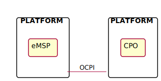
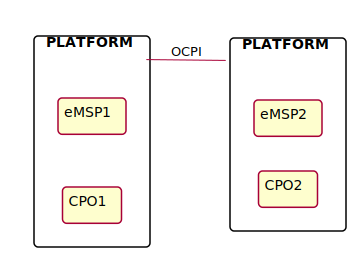
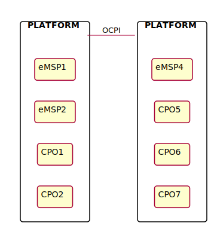
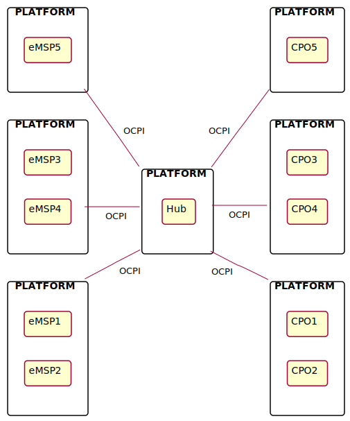
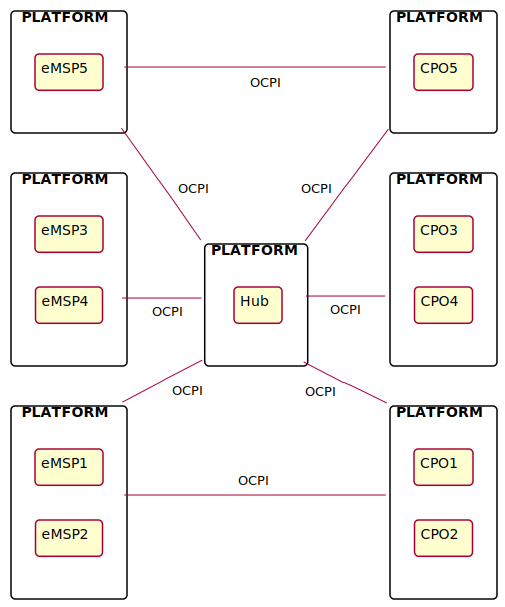

# Supported Topologies

OCPI started as a bilateral protocol, for peer-to-peer communication. Soon parties started to use OCPI via Hubs, but
OCPI 2.1.1 and earlier were not designed for that. OCPI 2.2 introduced a solution for this: [message
routing](https://ocpi.dev).

OCPI 2.2 introduced Platforms that connect via OCPI instead of CPO and eMSP, more on this in: [EV Charging Market
Roles](./02-terminology-and-definitions/03-ev-charging-market-roles.md)

## Peer-to-peer

The simplest topology is a bilateral connection: peer-to-peer between two platforms, and in the most simple version each
platform only has 1 role.

## Multiple peer-to-peer connections

A more real-world topology where multiple parties connect their platforms and each platform only has 1 role. (Not every
party necessarily connects with all the other parties with the other role).

## Peer-to-peer multiple the same roles

Some parties provide for example CPO or eMSP services for other companies. So the platform hosts multiple parties with
the same role. This topology is a bilateral connection: peer-to-peer between two platforms, and both platforms can have
multiple roles.

## Peer-to-peer dual roles

Some parties have dual roles, most of the companies are CPO and eMSP. This topology is a bilateral connection:
peer-to-peer between two platforms, and both platforms have the CPO and the eMSP roles.

## Peer-to-peer mixed roles

Some parties have dual roles, or provide them to other parties and then connect to other companies that do the same.
This topology is a bilateral connection: peer-to-peer between two platforms, and both platforms have multiple different
and also the same roles.

## Multiple peer-to-peer

More a real-world topology when OCPI is used between market parties without a hub, all parties are platforms with
multiple roles.

Disadvantage of this: requires a lot of connections between platforms to be setup, tested and maintained.

## Platforms via Hub

This topology has all Platforms only connect via a Hub, all communication goes via the Hub.

## Platforms via Hub and direct

Not all Platforms will only communicate via a Hub. There might be different reasons for Platforms to still have
peer-to-peer connections. The Hub might not yet support new functionality. The Platforms use a custom module for some
new project, which is not supported by the Hub. etc.

