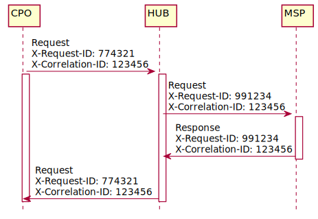

# Unique message IDs

For debugging issues, OCPI implementations are required to include unique IDs via HTTP headers in every
request/response.

| HTTP Header      | Description                                                                                                             |
|------------------|-------------------------------------------------------------------------------------------------------------------------|
| X-Request-ID     | Every request SHALL contain a unique request ID, the response to this request SHALL contain the same ID.                |
| X-Correlation-ID | Every request/response SHALL contain a unique correlation ID, every response to this request SHALL contain the same ID. |

:::note
HTTP header names are case-insensitive
:::

It is advised to used GUID/UUID as values for X-Request-ID and X-Correlation-ID.

When a Hub forwards a request to a party, the request to this party SHALL contain a new unique value in the X-Request-ID
HTTP header, not a copy of the X-Request-ID HTTP header taken from the incoming request that is being forwarded.

When a Hub forwards a request to a party, the request SHALL contain the same X-Correlation-ID HTTP header (with the same
value).

