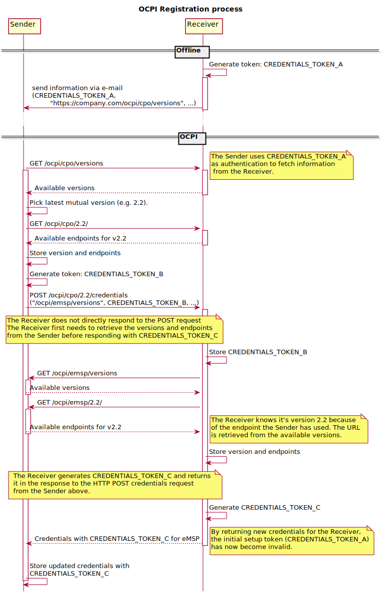
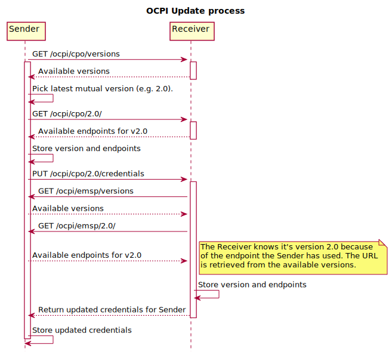

# Credentials

:::tip Module Identifier
credentials
:::

:::info Type
Configuration Module
:::

The credentials module is used to exchange the credentials token that has to be used by parties for authorization of
requests.

Every OCPI request is required to contain a credentials token in the [HTTP Authorization
header](/04-transport-and-format/01-json-http-implementation-guide.md#authorization-header).

## Use cases

### Registration

To start using OCPI, the Platforms will need to exchange credentials tokens.

To start the exchange of credentials tokens, one platform has to be selected as Sender for the Credentials module. This
has to be decided between the Platforms (outside of OCPI) before they first connect.

To start the credentials exchange, the Receiver Platform must create a unique credentials token: `CREDENTIALS_TOKEN_A`
that has to be used to authorize the Sender until the credentials exchange is finished. This credentials token along
with the versions endpoint SHOULD be sent to the Sender in a secure way that is outside the scope of this protocol.

The Sender starts the registration process, retrieves the version information and details (using `CREDENTIALS_TOKEN_A`
in the HTTP Authorization header). The Sender generates a unique credentials token: `CREDENTIALS_TOKEN_B`, sends it to
the Receiver in a POST request to the `credentials` module of the Receiver. The Receiver stores `CREDENTIALS_TOKEN_B`
and uses it for any requests to the Sender Platform, including the version information and details.

The Receiver generates a unique credentials token: `CREDENTIALS_TOKEN_C` and returns it to the Sender in the response to
the POST request from the Sender.

After the credentials exchange has finished, the Sender SHALL use `CREDENTIALS_TOKEN_C` in future OCPI request to the
Receiver Platform. The `CREDENTIALS_TOKEN_A` can then be thrown away, it MAY no longer be used.

(In the sequence diagrams below we use relative paths as short resource identifiers to illustrate API endpoints; please
note that they should be absolute URLs in any working implementation of OCPI.)



Due to its symmetric nature of the credentials module, any platform can be Sender and or the Receiver for this module.

### Updating to a newer version

At some point, both platforms will have implemented a newer OCPI version. To start using the newer version, one platform
has to send a PUT request to the credentials endpoint of the other platform.



### Changing endpoints for the current version

This can be done by following the update procedure for the same version.

By sending a PUT request to the credentials endpoint of this version, the other platform will fetch and store the
corresponding set of endpoints.

### Updating the credentials and resetting the credentials token

The credentials (or parts thereof, such as the credentials token) can be updated by sending the new credentials via a
PUT request to the credentials endpoint of the current version, similar to the update procedure described above.

Security advices: When one of the connecting platforms suspects that a credentials token is compromised, that platform
SHALL initiate a credentials token update as soon as possible. It is advisable to renew the credentials tokens at least
once a month, in case it was not detected that the credentials where compromised.

### Errors during registration

When the server connects back to the client during the credentials registration, it might encounter problems. When this
happens, the server should add the status code [3001](/05-status_codes.md#3xxx-server-errors) in the
response to the POST from the client.

### Required endpoints not available

When two platforms connect, it might happen that one of the platforms expects a certain endpoint to be available at the
other platform.

For example: a Platform with a CPO role could only want to connect when the CDRs endpoint is available in an platform
with an eMSP role.

In case the Sender (starting the credentials exchange process) cannot find the endpoints it expects, it is expected NOT
to send the POST request with credentials to the Receiver. Log a message/notify the administrator to contact the
administrator of the Receiver platform.

In case the Receiver platform that cannot find the endpoints it expects, then it is expected to respond to the request
with the status code [3003](/05-status_codes.md#3xxx-server-errors).

## Interfaces and endpoints

The Credentials module is different from all other OCPI modules. This module is symmetric, it has to be implemented by
all OCPI implementations, and all implementations need to be able call this module on any other platform, and have to be
able the handle receiving the request from another party.

Example: `/ocpi/2.2.1/credentials` and `/ocpi/emsp/2.2.1/credentials`

| Method                     | Description                                                                                       |
|----------------------------|---------------------------------------------------------------------------------------------------|
| [GET](https://ocpi.dev)    | Retrieves the credentials object to access the server's platform.                                 |
| [POST](https://ocpi.dev)   | Provides the server with a credentials object to access the client's system (i.e. register).      |
| [PUT](https://ocpi.dev)    | Provides the server with an updated credentials object to access the client's system.             |
| PATCH                      | n/a                                                                                               |
| [DELETE](https://ocpi.dev) | Informs the server that its credentials to the client's system are now invalid (i.e. unregister). |

### **GET** Method

Retrieves the credentials object to access the server's platform. The request body is empty, the response contains the
credentials object to access the server's platform. This credentials object also contains extra information about the
server such as its business details.

### **POST** Method

Provides the server with credentials to access the client's system. This credentials object also contains extra
information about the client such as its business details.

A `POST` initiates the registration process for this endpoint's version. The server must also fetch the client's
endpoints for this version.

If successful, the server must generate a new credentials token and respond with the client's new credentials to access
the server's system. The credentials object in the response also contains extra information about the server such as its
business details.

This method MUST return a `HTTP status code 405: method not allowed` if the client has already been registered before.

### **PUT** Method

Provides the server with updated credentials to access the client's system. This credentials object also contains extra
information about the client such as its business details.

A `PUT` will switch to the version that contains this credentials endpoint if it's different from the current version.
The server must fetch the client's endpoints again, even if the version has not changed.

If successful, the server must generate a new credentials token for the client and respond with the client's updated
credentials to access the server's system. The credentials object in the response also contains extra information about
the server such as its business details.

This method MUST return a `HTTP status code 405: method not allowed` if the client has not been registered yet.

### **DELETE** Method

Informs the server that its credentials to access the client's system are now invalid and can no longer be used. Both
parties must end any automated communication. This is the unregistration process.

This method MUST return a `HTTP status code 405: method not allowed` if the client has not been registered before.

## Object description

### Credentials object

| Property | Type                                   | Card. | Description                                                                                                                                                                                                                                   |
|----------|----------------------------------------|-------|-----------------------------------------------------------------------------------------------------------------------------------------------------------------------------------------------------------------------------------------------|
| token    | [string](/16-types.md#string-type)(64) | 1     | The credentials token for the other party to authenticate in your system. It should only contain printable non-whitespace ASCII characters, that is, characters with Unicode code points from the range of U+0021 up to and including U+007E. |
| url      | [URL](/16-types.md#url-type)           | 1     | The URL to your API versions endpoint.                                                                                                                                                                                                        |
| roles    | [CredentialsRole](https://ocpi.dev)    | \+    | List of the roles this party provides.                                                                                                                                                                                                        |

Every role needs a unique combination of: `role`, `party_id` and `country_code`.

A platform can have the same role more than once, each with its own unique `party_id` and `country_code`, for example
when a CPO provides *white-label* services for *virtual* CPOs.

One or more roles and thus `party_id` and `country_code` sets are provided here to inform a server about the `party_id`
and `country_code` sets a client will use when pushing [Client Owned
Objects](/04-transport-and-format/01-json-http-implementation-guide.md#client-owned-object-push). This helps a server to determine
the URLs a client will use when pushing a [Client Owned
Object](/04-transport-and-format/01-json-http-implementation-guide.md#client-owned-object-push). The `country_code` is added to
make certain the URL used when pushing a [Client Owned
Object](/04-transport-and-format/01-json-http-implementation-guide.md#client-owned-object-push) is unique as there might be
multiple parties in the world with the same `party_id`. The combination of `country_code` and `party_id` should always
be unique though. A party operating in multiple countries can always use the home country of the company for all
connections.

For example: EVSE IDs can be pushed under the country and provider identification of a company, even if the EVSEs are
actually located in a different country. This way it is not necessary to establish one OCPI connection per country a
company operates in.

The `party_id` and `country_code` given here have no direct link with the eMI3 EVSE IDs and Contract IDs that might be
used in the different OCPI modules. A party implementing OCPI MAY push EVSE IDs with an eMI3 `spot operator` different
from the OCPI `party_id` and/or the `country_code`.

A Hub SHALL only reports itself as role: Hub. A Hub SHALL NOT report all the other connected parties as a role on the
platform. A Hub SHALL report connected parties via the [HubClientInfo
module](https://ocpi.dev).

### Examples

Example of a minimal CPO credentials object:

```json
{
  "token": "ebf3b399-779f-4497-9b9d-ac6ad3cc44d2",
  "url": "https://example.com/ocpi/versions",
  "roles": [
    {
      "role": "CPO",
      "party_id": "EXA",
      "country_code": "NL",
      "business_details": {
        "name": "Example Operator"
      }
    }
  ]
}
```

Example of a combined CPO/eMSP credentials object:

```json
{
  "token": "9e80a9c4-28be-11e9-b210-d663bd873d93",
  "url": "https://ocpi.example.com/versions",
  "roles": [
    {
      "role": "CPO",
      "party_id": "EXA",
      "country_code": "NL",
      "business_details": {
        "name": "Example Operator"
      }
    },
    {
      "role": "EMSP",
      "party_id": "EXA",
      "country_code": "NL",
      "business_details": {
        "name": "Example Provider"
      }
    }
  ]
}
```

Example of a CPO credentials object with full business details:

```json
{
  "token": "9e80ae10-28be-11e9-b210-d663bd873d93",
  "url": "https://example.com/ocpi/versions",
  "roles": [
    {
      "role": "CPO",
      "party_id": "EXA",
      "country_code": "NL",
      "business_details": {
        "name": "Example Operator",
        "logo": {
          "url": "https://example.com/img/logo.jpg",
          "thumbnail": "https://example.com/img/logo_thumb.jpg",
          "category": "OPERATOR",
          "type": "jpeg",
          "width": 512,
          "height": 512
        },
        "website": "http://example.com"
      }
    }
  ]
}
```

Example of a CPO credentials object for a platform that provides services for 3 CPOs:

```json
{
  "token": "9e80aca8-28be-11e9-b210-d663bd873d93",
  "url": "https://ocpi.example.com/versions",
  "roles": [
    {
      "role": "CPO",
      "party_id": "EXO",
      "country_code": "NL",
      "business_details": {
        "name": "Excellent Operator"
      }
    },
    {
      "role": "CPO",
      "party_id": "PFC",
      "country_code": "NL",
      "business_details": {
        "name": "Plug Flex Charging"
      }
    },
    {
      "role": "CPO",
      "party_id": "CGP",
      "country_code": "NL",
      "business_details": {
        "name": "Charging Green Power"
      }
    }
  ]
}
```

## Data types

### CredentialsRole *class*

| Property         | Type                                      | Card. | Description                                                                    |
|------------------|-------------------------------------------|-------|--------------------------------------------------------------------------------|
| role             | [Role](/16-types.md#role-enum)            | 1     | Type of role.                                                                  |
| business_details | [BusinessDetails](https://ocpi.dev)       | 1     | Details of this party.                                                         |
| party_id         | [CiString](/16-types.md#cistring-type)(3) | 1     | CPO, eMSP (or other role) ID of this party (following the ISO-15118 standard). |
| country_code     | [CiString](/16-types.md#cistring-type)(2) | 1     | ISO-3166 alpha-2 country code of the country this party is operating in.       |
