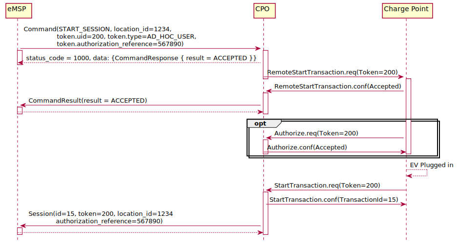
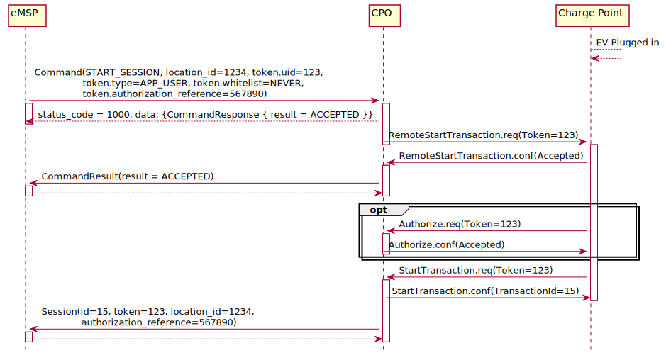

# Flow

With the Commands module, commands can be sent from the eMSP, via the CPO to a Charge Point. Most Charge Points are
hooked up to the internet via a relative slow wireless connection. To prevent long blocking calls, the commands module
is designed to work asynchronously.

The Sender (typically eMSP) send a request to a Receiver (typically CPO), via the Receivers Commands interface. The
Receiver checks if it can send the request to a Charge Point and will respond to the request with a status, indicating
if the request can be sent to a Charge Point.

The Receiver (typically CPO) sends the requested command (via another protocol, for example: OCPP) to a Charge Point.
The Charge Point will respond if it understands the command and will try to execute the command. This response doesn't
always mean that the command was executed successfully. The Receiver (typically CPO) will forward the result in a new
POST request to the Senders Commands interface.

The following examples try to give insight into the message flow and the asynchronous nature of the OCPI Commands.

Example of a `START_SESSION` that is accepted, but no new Session is started because EV not plugged in before end of
time-out. This is an example for Charge Point that allows a remote start when the cable is not yet plugged in. Some
Charge Points even require this, there might, for example, be a latch in front of the socket to prevent vandalism.

Example of a `START_SESSION` that is accepted, but no new Session is started because the EV is not plugged in, and this
Charge Point does not allow a remote start without a cable already being plugged in.

Example of a `START_SESSION` that is accepted and results in a new Session.

Example of a `START_SESSION` with a Token that is Whitelist: NEVER.

The CPO should not check the Token in the START_SESSION, before sending it to the Charge Point. The CPO should assume
that the eMSP only sends valid Tokens in the START_SESSION object.

If needed, the Charge Point does an OCPP Authorize request to validate the Token (proved via OCPP). In such case the CPO
only does an [realtime authorization](/ocpi/06-modules/07-tokens/04-flow-and-lifecycle.md#real-time-authorization) when
the OCPP Authorize request is for an RFID Token and the START_SESSION for this Token was received more then 15 minutes
ago.

Example of a `UNLOCK_CONNECTOR` that fails because the Location is not known by the CPO.

Example of a `RESERVE_NOW` that is rejected by the Charge Point.

Example of a successful `RESERVE_NOW`.

Reservation canceled by the CPO. OCPI makes it possible for a CPO to cancel a reservation. This is not to be taken
lightly. When a driver makes a reservation of a Charge Point/EVSE, he/she wants to be sure to have a charging location.
So if the CPO cancel the reservation, the driver will for sure not like it. But there are some circumstances where the
CPO is forced to cancel a reservation. For example: Charge Point has become defect, or the CPO is notified of ongoing
roadworks which makes the Charge Point unreachable etc.

To Cancel a reservation the CPO call the Senders interface with the same URL as was given by the Sender (eMSP) when the
`RESERVE_NOW` command was send.

The sequence diagram below continues after the sequence diagram above.

These examples use OCPP 1.6 based commands between CPO and Charge Point, but that is not a requirement for OCPI.

If the Sender (typically eMSP) wants to have a reference between the calls sent to the Receivers interface and the
asynchronous result received from the Charge Point via the CPO, the Sender can make some unique identifier part of
the\`response_url\` that is part of every method in the Receiver interface. The Receiver will call this URL when the
result is received from the Charge Point. The Sender can then match the unique identifier from the URL called with the
request.
